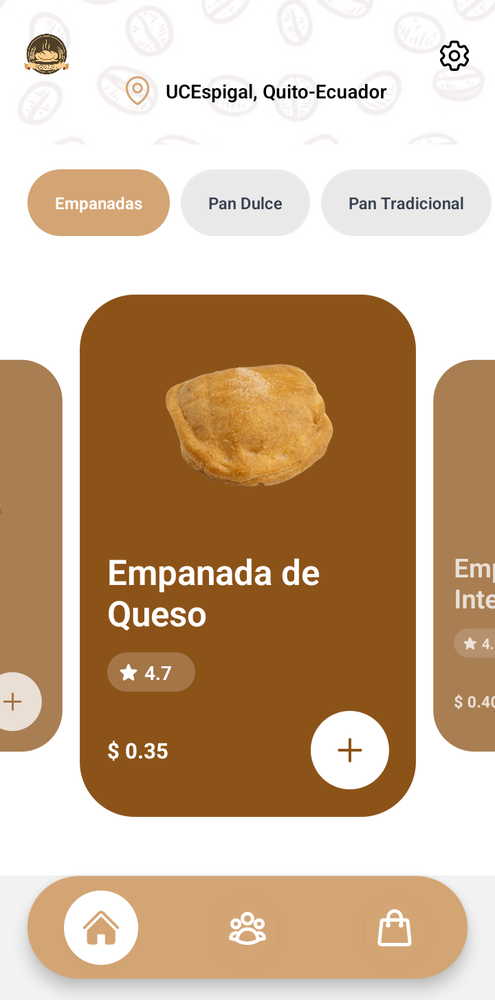
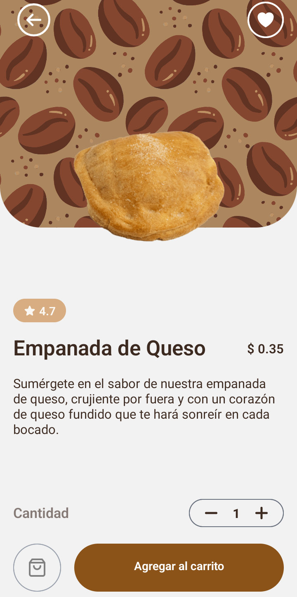
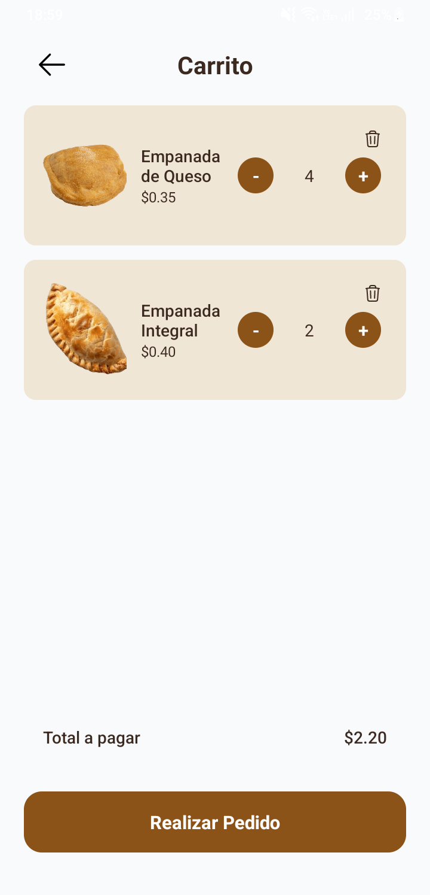
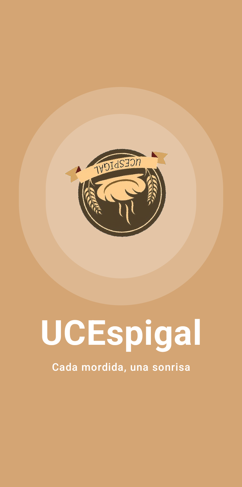
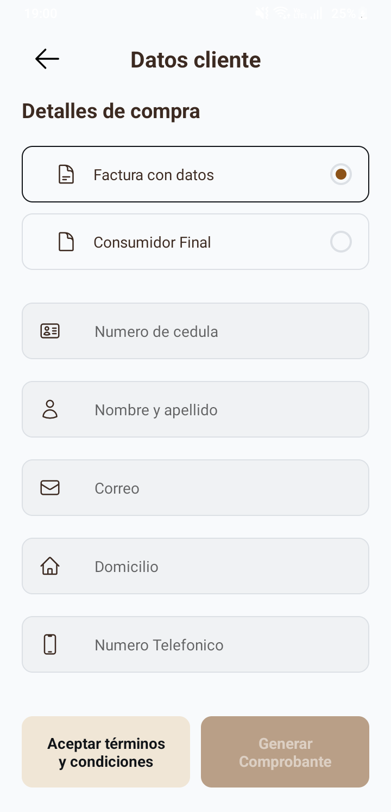
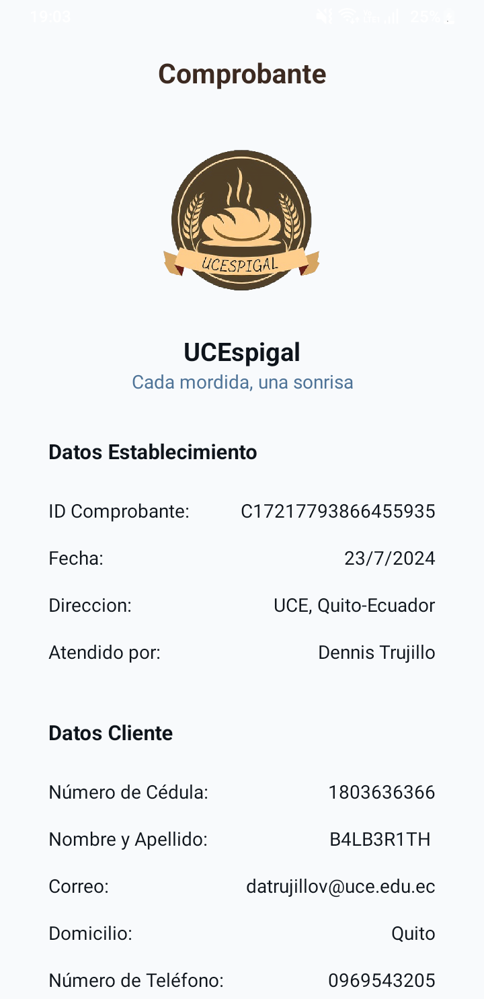
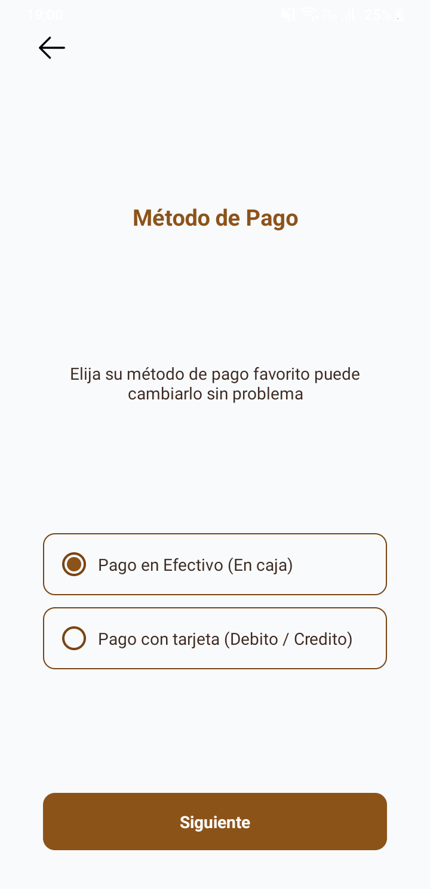
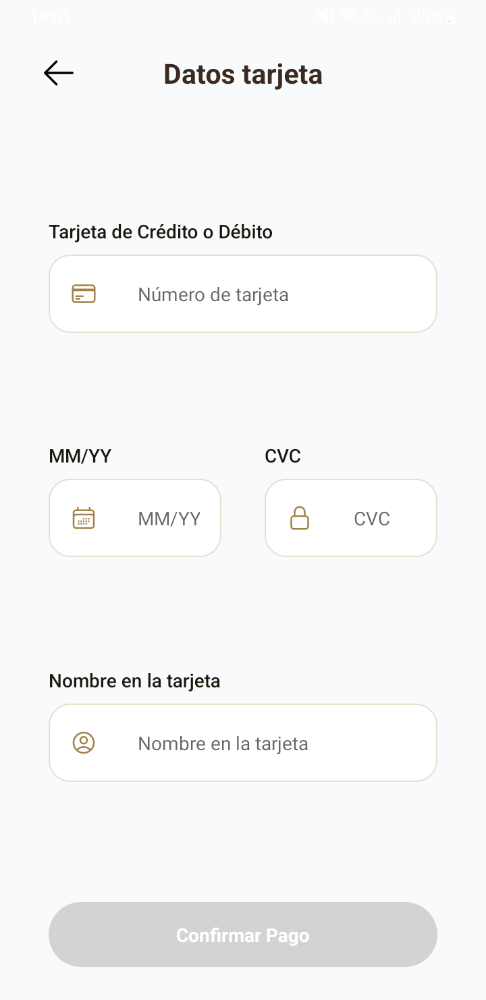
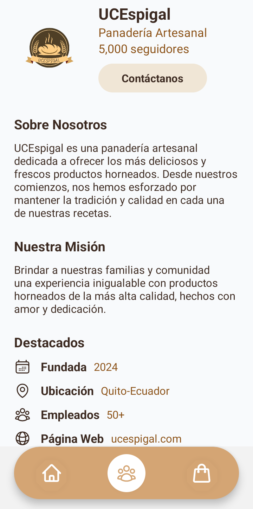

# UCEspigal 🥐

¡Bienvenido a **UCEspigal**! Este proyecto es una aplicación móvil desarrollada con **React Native** y **Expo**, enfocada en la venta y promoción de productos relacionados con la panderia, como panes, empanadas, pasteles y bebidas.

## Características 🚀

- **Navegación fluida**: Implementación de navegación entre pantallas como la pantalla de inicio, carrito, detalles del producto y más.
- **Context API**: Manejo del estado global para la gestión del carrito y la información del usuario.
- **Interfaz atractiva**: Tema personalizado con colores y diseño adaptado a la temática del café.
- **Assets variados**: Imágenes de alta calidad de productos para una experiencia visual enriquecida.

## Colaboradores Iniciales 👥

Un agradecimiento especial a los colaboradores que ayudaron a dar forma a este proyecto desde el inicio:

|  |  |  |
|:-------------------------------------------------:|:-------------------------------------------------:|:-------------------------------------------------:|
| **[Dennis290699](https://github.com/Dennis290699)**   | **[Rensso26](https://github.com/Rensso26)**   | **[XavierT1](https://github.com/XavierT1)**   |

## Estructura del Proyecto 📁

```
react-coffe/
│
├── .expo/                 # Configuraciones de Expo
├── .git/                  # Archivos de Git para control de versiones
├── .idea/                 # Configuraciones del proyecto para JetBrains IDEs
├── assets/                # Imágenes y recursos multimedia
├── components/            # Componentes reutilizables de React Native
├── constants/             # Datos constantes utilizados en la aplicación
├── context/               # Contextos de React para manejar el estado global
├── navigation/            # Configuración de la navegación de la app
├── screens/               # Pantallas principales de la aplicación
├── theme/                 # Temas y colores personalizados
├── utils/                 # Funciones utilitarias (aún vacío)
├── App.js                 # Punto de entrada de la aplicación
├── app.json               # Configuraciones de la app para Expo
├── package.json           # Dependencias y scripts del proyecto
└── README.md              # Documentación del proyecto
```

## Instalación 🔧

Sigue estos pasos para configurar el proyecto localmente:

1. Clona este repositorio:

   ```bash
   git clone https://github.com/Dennis290699/UCEspigal.git
   ```

2. Navega al directorio del proyecto:

   ```bash
   cd UCEspigal
   ```

3. Instala las dependencias:

   ```bash
   npm install
   ```

4. Inicia el proyecto en Expo:

   ```bash
   npm start
   ```

## Uso 📱

Una vez que la aplicación esté en funcionamiento, podrás navegar a través de las diferentes pantallas para explorar los productos disponibles, añadirlos al carrito y proceder a la compra.

## Capturas de Pantalla 📸

Aquí puedes ver capturas de pantalla de la aplicación en acción:

| Pantalla de Inicio | Pantalla de Producto | Pantalla de Carrito |
|--------------------|----------------------|---------------------|
|  |  |  |

| Pantalla de Bienvenida | Pantalla de Datos del Consumidor | Pantalla de Comprobante |
|------------------------|----------------------------------|-------------------------|
|  |  |  |

| Pantalla de Método de Pago | Pantalla de Datos de la Tarjeta | Pantalla Sobre Nosotros |
|----------------------------|---------------------------------|-------------------------|
|  |  |  |

## Contribuciones 🤝

Las contribuciones son bienvenidas. Siéntete libre de abrir un issue o enviar un pull request.

## Licencia 📄

Este proyecto está bajo la Licencia MIT. Consulta el archivo [LICENSE](LICENSE.md) para obtener más detalles.
